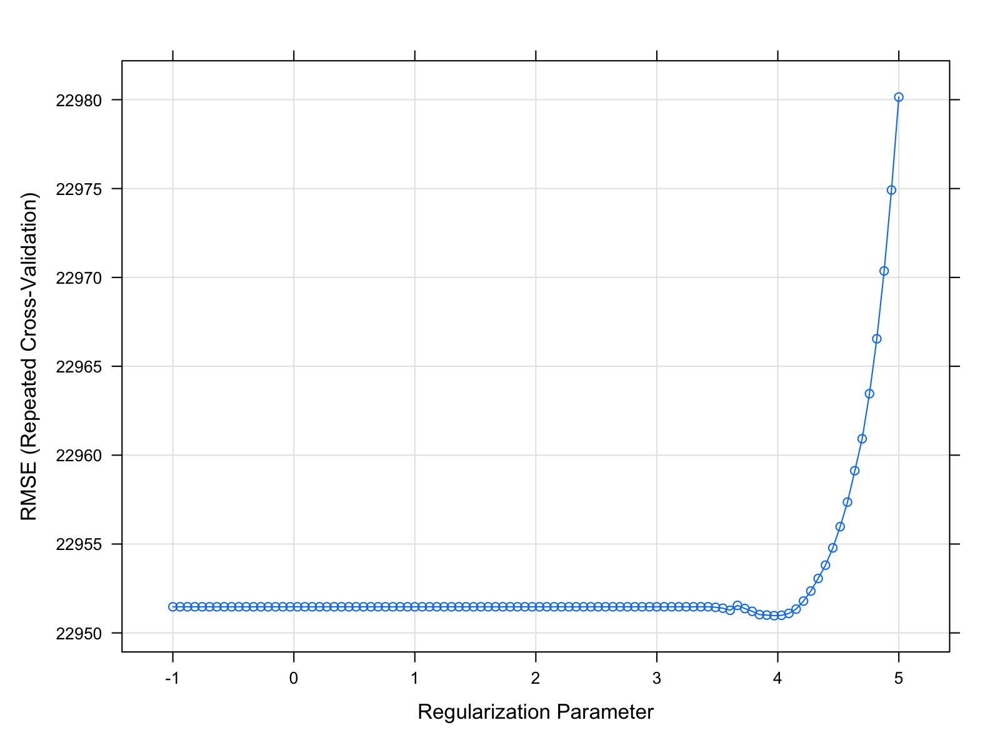
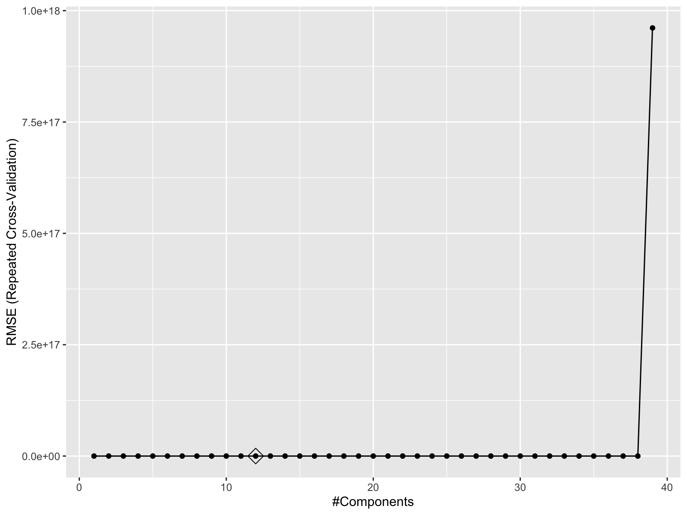
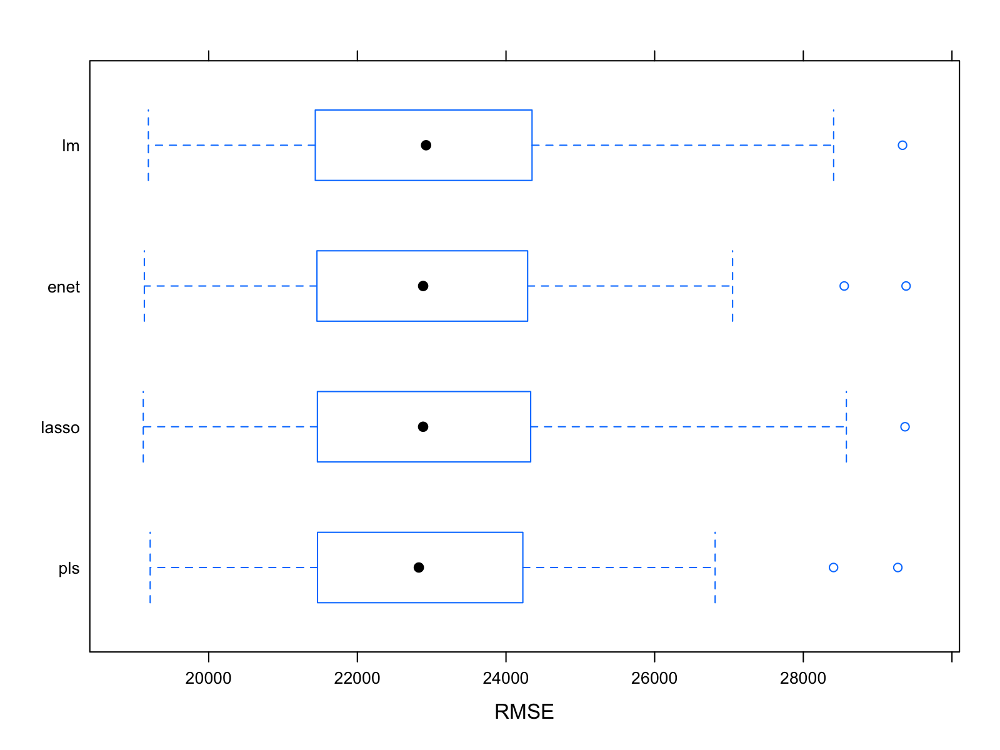

p8106\_hw1
================
hw2849
2/21/2022

``` r
## data import
housing_test = read_csv("./housing_test.csv") %>% 
  janitor::clean_names()
housing_training = read_csv("./housing_training.csv") %>% 
  janitor::clean_names()

##plot response sale price
plot(housing_training$sale_price)
```


``` r
## training net x and y 
x_train = model.matrix(sale_price ~ ., housing_training)[,-1]
y_train = housing_training$sale_price

## test net x and y
x_test = model.matrix(sale_price ~ ., housing_test)[,-1]
y_test = housing_test$sale_price
```

## Least square model

1.  Fit a linear model using least squares on the training data. Is
    there any potential disadvantage of this model?

``` r
set.seed(8106)

## set control
ctrl1 <- trainControl(method = "repeatedcv", number = 10, repeats = 5) # ten-fold cross-validation

## lm least squares
fit_ls = train(
  sale_price~.,
  data = housing_training,
  method = "lm",
  trControl = ctrl1) 

fit_ls$results
```

    ##   intercept     RMSE  Rsquared      MAE   RMSESD RsquaredSD    MAESD
    ## 1      TRUE 22976.99 0.9033741 16728.57 2245.477 0.01962937 1261.516

``` r
## test error
pred_lm = predict(fit_ls$finalModel, newdata = data.frame(x_test))
mean((pred_lm - y_test)^2)
```

    ## [1] 447287652

-   Potential disadvantage:

## Lasso

2.  Fit a lasso model on the training data and report the test error.
    When the 1SE rule is applied, how many predictors are included in
    the model?

``` r
## lasso
set.seed(8106)
fit_lasso = train(x_train, y_train, 
                method = "glmnet",
                tuneGrid = expand.grid(alpha = 1, lambda = exp(seq(5, -1, length = 100))),
                trControl = ctrl1)

## plot lasso with log function
plot(fit_lasso, xTrans = log)
```



``` r
# fit_lasso$bestTune

set.seed(8106)
# test error
pred_lasso = predict(fit_lasso, newdata = data.frame(x_test))
mean((pred_lasso - y_test)^2)
```

    ## [1] 441224318

-   test error: 441224318
-   how many predictors:

## Elastic net

3.  Fit an elastic net model on the training data. Report the selected
    tuning parameters and the test error.

``` r
set.seed(8106)
fit_enet <- train(x_train, y_train,
                  method = "glmnet",
                  tuneGrid = expand.grid(alpha = seq(0, 1, length = 21),
                                         lambda = exp(seq(2, -2, length = 50))),
                  trControl = ctrl1)

## tunning parameters
fit_enet$bestTune
```

    ##     alpha   lambda
    ## 100  0.05 7.389056

``` r
# tset error
pred_enet = predict(fit_enet, newdata = data.frame(x_test))
mean((pred_enet - y_test)^2)
```

    ## [1] 442020913

-   tuning parameters: *α* = 0.05, *λ* = 7.389056,
-   test error: 442020913

## Partial least squares

4.  Fit a partial least squares model on the training data and report
    the test error. How many components are included in your model?

``` r
set.seed(8106)
fit_pls = train( x_train, y_train,
                 method = "pls", 
                 tuneGrid = data.frame(ncomp = 1:19),
                 trControl = ctrl1,
                 preProcess = c("center", "scale"))

ggplot(fit_pls, highlight = TRUE)
```



``` r
pred_pls <- predict(fit_pls, newdata = data.frame(x_test))
mean((pred_pls - y_test)^2)
```

    ## [1] 449622718

-   test error: 449622718
-   how many components:

## Models comparison

5.  Which model will you choose for predicting the response? Why?

``` r
## comparison of models by resampling
resamp = resamples(list(lm = fit_ls, 
                        lasso = fit_lasso,
                        enet = fit_enet, 
                        pls = fit_pls))

summary(resamp)
```

    ## 
    ## Call:
    ## summary.resamples(object = resamp)
    ## 
    ## Models: lm, lasso, enet, pls 
    ## Number of resamples: 50 
    ## 
    ## MAE 
    ##           Min.  1st Qu.   Median     Mean  3rd Qu.     Max. NA's
    ## lm    14421.48 15832.92 16643.39 16728.57 17507.10 20691.87    0
    ## lasso 14407.32 15691.11 16612.62 16685.36 17440.93 20561.24    0
    ## enet  14417.66 15728.87 16633.05 16683.23 17446.51 20607.04    0
    ## pls   14449.06 15880.62 16625.37 16726.31 17474.22 20601.92    0
    ## 
    ## RMSE 
    ##           Min.  1st Qu.   Median     Mean  3rd Qu.     Max. NA's
    ## lm    19188.15 21542.36 22924.57 22976.99 24302.34 29335.25    0
    ## lasso 19119.20 21491.01 22884.67 22950.97 24315.62 29368.90    0
    ## enet  19133.79 21496.20 22885.04 22946.31 24290.11 29382.77    0
    ## pls   19212.28 21464.88 22827.16 22942.48 24222.16 29271.89    0
    ## 
    ## Rsquared 
    ##            Min.   1st Qu.    Median      Mean   3rd Qu.      Max. NA's
    ## lm    0.8516039 0.8908533 0.9044424 0.9033741 0.9185762 0.9353592    0
    ## lasso 0.8523273 0.8903566 0.9048502 0.9036492 0.9182993 0.9351474    0
    ## enet  0.8521532 0.8903736 0.9048406 0.9036721 0.9184741 0.9353995    0
    ## pls   0.8525984 0.8907140 0.9045228 0.9036579 0.9187683 0.9363752    0

``` r
bwplot(resamp, metric = "RMSE")
```



-   I would choose PLS to predict the response (sale prices), because
    PLS model has the lowest RMSE in both median(22827.16) and
    mean(22942.48.
